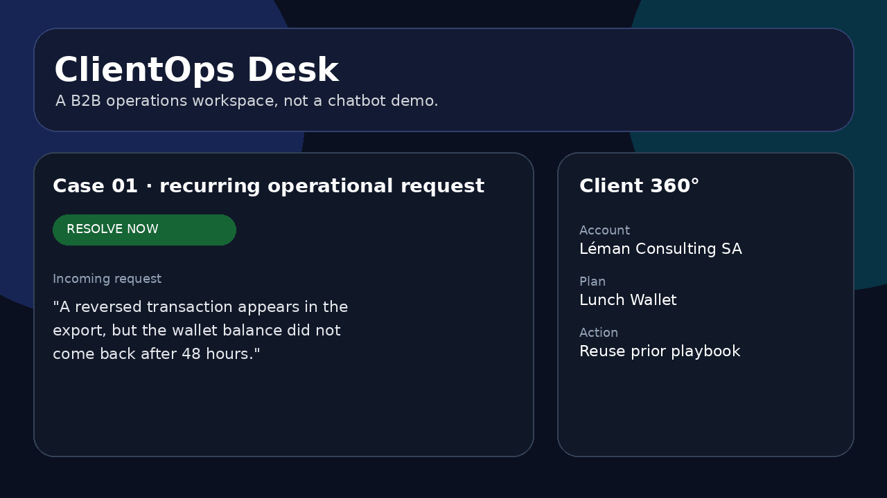
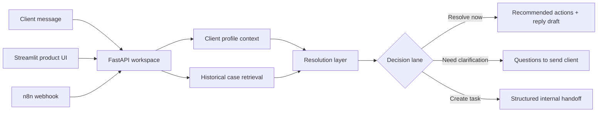

# ClientOps Desk

> **A polished B2B operations workspace mockup that helps a client-facing team resolve recurring requests faster, ask for missing facts before creating noise, and generate structured internal handoffs for genuinely new cases.**



## The story behind the project

I built this as a **fictionalized concept prototype inspired by a family-run B2B service business**. The company model in this repo is a corporate meal-services provider: client companies sponsor lunch wallets and employee meal access, while HR/admin contacts send recurring operational questions.

The problem I wanted to solve was not “how do I add AI to support?” It was:

> **How can a small operations team spend less time reconstructing context and more time moving client requests forward correctly?**

So I built **ClientOps Desk** — a product-like internal workspace that combines:

- incoming client request intake;
- a mock **Client 360°** context panel;
- retrieval of similar historical cases;
- a resolution lane:
  - `RESOLVE_NOW`
  - `NEED_CLIENT_CLARIFICATION`
  - `CREATE_INTERNAL_TASK`
- a client-facing reply draft;
- a clean escalation/task draft when needed;
- a workflow trace that makes the decision path inspectable.

## Why this feels production-ready

This is intentionally not a chatbot page. It is a **small internal product** with:

- FastAPI backend;
- Streamlit operator console with premium UI styling;
- retrieval over a case library;
- optional Claude structured-output reasoning;
- n8n importable workflow;
- generated task persistence;
- Docker Compose setup;
- tests and CI-ready structure;
- clear product, architecture, and demo docs.

## Demo scenarios

The UI includes six realistic B2B operations cases:

1. **Roster sync · missing lunch credits** — resolve from a prior playbook.
2. **Merchant scope · card refused at café** — distinguish product rule from incident.
3. **Cutoff request · change next Tuesday order** — interpret an operational policy.
4. **Invoice discrepancy · insufficient detail** — ask for the minimum evidence first.
5. **Dietary update · meal preview mismatch** — identify a timing mismatch.
6. **Refund ledger · balance not restored** — create a structured internal task for a sensitive new issue.

## Architecture



## Repo structure

```text
clientops-desk/
├── README.md
├── ui/app.py
├── src/clientops_desk/
│   ├── app.py
│   ├── llm.py
│   ├── retrieval.py
│   ├── decision_engine.py
│   ├── tasking.py
│   ├── schemas.py
│   └── data_access.py
├── data/
│   ├── clients.json
│   ├── knowledge_base/cases.jsonl
│   ├── sample_requests/*.json
│   └── generated_tasks/
├── n8n/workflow.json
├── scripts/demo_cli.py
├── docs/
├── tests/
├── Dockerfile
├── docker-compose.yml
└── Makefile
```

## Quick start

### 1. Create a virtual environment

```bash
python -m venv .venv
source .venv/bin/activate
pip install -r requirements.txt
```

### 2. Configure environment

```bash
cp .env.example .env
```

By default the repo runs in deterministic **mock mode**, so the demo works immediately without paid API credentials.

### 3. Start the API

```bash
PYTHONPATH=src uvicorn clientops_desk.app:app --reload
```

API docs:
- `http://localhost:8000/docs`

### 4. Start the product UI

```bash
PYTHONPATH=src streamlit run ui/app.py
```

UI:
- `http://localhost:8501`

### 5. Run CLI demos

```bash
python scripts/demo_cli.py --scenario roster
python scripts/demo_cli.py --scenario merchant
python scripts/demo_cli.py --scenario cutoff
python scripts/demo_cli.py --scenario invoice
python scripts/demo_cli.py --scenario dietary
python scripts/demo_cli.py --scenario refund
```

### 6. Full Docker demo

```bash
cp .env.example .env
docker compose up --build
```

## Optional live Claude mode

Set:

```bash
LLM_MODE=anthropic
ANTHROPIC_API_KEY=your_key_here
ANTHROPIC_MODEL=claude-sonnet-4-6
```

The live path uses a schema-constrained JSON response so the UI receives a stable `ResolutionPacket` contract.

## n8n workflow

Import:

```text
n8n/workflow.json
```

It demonstrates:

1. webhook intake;
2. POST to `/analyze`;
3. branching on `lane`;
4. handling task-creation cases separately.

## Tests

```bash
PYTHONPATH=src pytest -q
```

## What I would say in an interview

> I built ClientOps Desk as a product mockup for a fictionalized family B2B service business. I wanted it to feel like a real internal tool, not an AI chatbot. It brings client context, historical precedents, next-best actions, and escalation drafting into one workspace. I deliberately designed it so that routine cases are handled quickly, vague cases ask for better information, and new or sensitive cases become clean internal handoffs rather than overconfident answers.

## Supporting docs

- [`docs/PRODUCT_STORY.md`](docs/PRODUCT_STORY.md)
- [`docs/ARCHITECTURE.md`](docs/ARCHITECTURE.md)
- [`docs/DEMO_SCRIPT.md`](docs/DEMO_SCRIPT.md)
- [`docs/ROLE_ALIGNMENT.md`](docs/ROLE_ALIGNMENT.md)
- [`docs/SECURITY.md`](docs/SECURITY.md)
