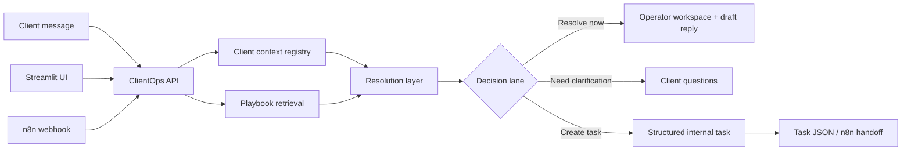

# Architecture

## Core services

- `FastAPI`: exposes the request analysis API.
- `TF-IDF retrieval`: ranks similar historical playbook cases in offline demo mode.
- `Decision layer`: selects a resolution lane in a deterministic demo-safe way.
- `Claude integration`: optional live reasoning layer with structured JSON output.
- `Streamlit UI`: makes the product story visually obvious.
- `n8n workflow`: demonstrates API orchestration and downstream routing.

## Design choices

- **Offline-first demo:** the project works without paid API access.
- **Model optionality:** setting `LLM_MODE=anthropic` upgrades the reasoning layer while preserving the same data contract.
- **Human-visible outputs:** every lane creates something an operator can inspect, not only an abstract classification.
- **Contextual escalation:** escalations carry request text, account context, and a structured task draft.
